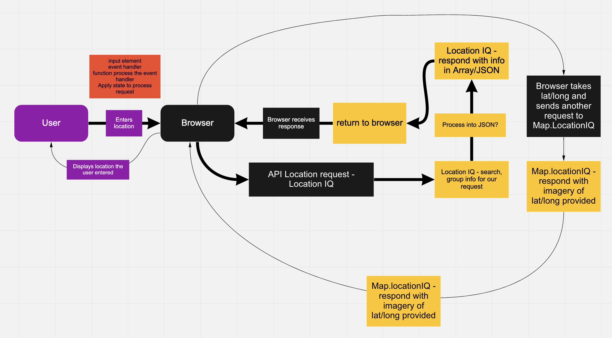
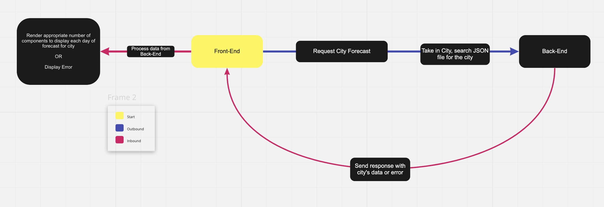

# City Explorer

**Author**: Haustin Kimbrough
**Version**: 1.0.0 (increment the patch/fix version number if you make more commits past your first submission)

## Overview
<!-- Provide a high level overview of what this application is and why you are building it, beyond the fact that it's an assignment for this class. (i.e. What's your problem domain?) -->

City Explorer is a React application that queries the user(s) for a location (city), request an API from [LocationIQ](https://locationiq.com/), and then display that location through imagery/mapping. City Explorer also informs users of request errors.

### Day 1 WRRC

### Day 2 WRRC

### Day 3 WRRC

## Getting Started
<!-- What are the steps that a user must take in order to build this app on their own machine and get it running? -->
To create City Explorer for yourself, create a React application and a repository. Link those two together. Within a code editor, create an input field that calls for user response and links that to an API request with LocationIQ. Pull the relevant data (latitude and longitude) from that LocationIQ response and assign it to another API request also to LocationIQ to retrieve the map data and display the map in its own React-Bootstrap component.

## Architecture
<!-- Provide a detailed description of the application design. What technologies (languages, libraries, etc) you're using, and any other relevant design information. -->
 City Explorer is a React application that uses JavaScript and JSX. API calls are sent to LocationIQ. The components are styled with CSS3 and [React Bootstrap](https://react-bootstrap.github.io/) and the repository is on [Github](https://github.com/hkimbrough22/city-explorer).

## Change Log

<!-- Use this area to document the iterative changes made to your application as each feature is successfully implemented. Use time stamps. Here's an example:

01-01-2001 4:59pm - Application now has a fully-functional express server, with a GET route for the location resource. -->

### Lab 06 - Feature 1

Name of feature: Locations

Estimate of time needed to complete: 90 minutes

Start time: 1656

Finish time: 22:58

Actual time needed to complete: 120 minutes (had to step away and finish later)

### Lab 06 - Feature 2

Name of feature: Maps

Estimate of time needed to complete: 45 minutes

Start time: 22:59

Finish time: 23:40

Actual time needed to complete: 41 minutes

### Lab 06 - Feature 3

Name of feature: Errors

Estimate of time needed to complete: 60 minutes

Start time: 00:00

Finish time: 00:38

Actual time needed to complete: 38 minutes

### Lab07 - Feature 1

Name of feature: Weather

Estimate of time needed to complete: 150 minutes

Start time: 16:22

Finish time: 19:30

Actual time needed to complete: 188 minutes

### Lab07 - Feature 2

Name of feature: Error

Estimate of time needed to complete: 60 minutes

Start time: 22:00

Finish time: 22:56

Actual time needed to complete: 56 minutes

### Lab08 - Feature 1

Name of feature: Weather (live)

Estimate of time needed to complete: 120 minutes

Start time: 14:00

Finish time: 16:26

Actual time needed to complete: 146 minutes

## Credit and Collaborations
<!-- Give credit (and a link) to other people or resources that helped you build this application. -->
- Marco worked with me to create the WRRC
- [Code Fellows Code 301 Class Repo](https://github.com/codefellows/seattle-code-301d77) for .gitignore
- [Patrick Laurion](https://github.com/plaurion1989) helped with the error message of Lab 06 - Feature 03
- TA Hexx King helped a ton with Lab 08 - Feature 1.
